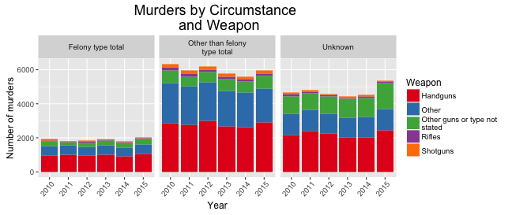

## The Data

Every year, the FBI publishes the Crime in the US (CIUS) report, which includes a wealth of data on different crimes.  This data is distributed as a group of about 300 tables, each in their own Excel file, showing aggregate statistics on different crimes grouped by location, type, victim characteristics, or other variables.

The specific question that the FBICrimeStats app answers is: "What murder weapons are used in different circumstances?"

--- 

## Motivation

- The CIUS tables can be ambiguously named and the information sought is often hard to find.
- Even with the correct table located, it can be difficult to quickly compare different categories to one another: visualizations are much easier to comprehend quickly.
- Many of the variables have more categories than are of interest.  Letting the user choose which categories are displayed allows for higher information content on a single plot.

---

## The App

The app has 3 tabs.


The "Welcome" tab has information about the app and instructions on how to use it, the "Plot" tab contains the interactive plot of the CIUS murder by circumstance and weapon, and the "Data tables" tab that shows the data as it was released by the FBI.

The main purpose of the app is the Plot tab, which allows you to choose a subset of the data to plot on a stacked bar chart.  You can choose which variable is used to split the data into panels, which is shown along the x-axis, and which is used as the fill color for the stacked bars.

The variables for this data set are "Circumstance," which is the context in which the murder was committed, "Weapon," which is the murder weapon used, and "Year," which is the year the murders were committed.


---

## Example

An example plot is shown that highlights guns vs other murder weapons for felony-type circumstances, non-felony-type circumstances, and unknown circumstances from 2010-2015.


```r
circumstances <- c("Felony type total", "Other than felony type total", "Unknown")
weapons <- c("Handguns", "Rifles", "Shotguns", "Other guns or type not stated")
years <- c(2010, 2011, 2012, 2013, 2014, 2015)
dat <- prep_data(dataset, "Circumstances", circumstances, "Year", years, "Weapon", weapons)
stacked_bar(dat, "Year", "Weapon")
```




